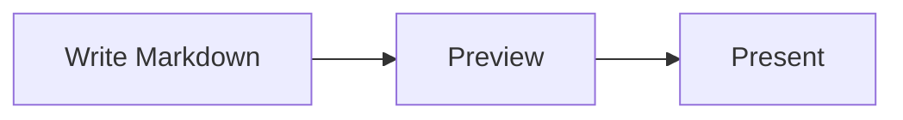

# Diagrams and media

> 日本語版: [日本語](ja/diagrams-and-media.md)

MarkdStage supports Markdown images, Mermaid for automatic layout, Architecture DSL for stable
placement and routing, and imported Archify diagrams.

## Use Mermaid for automatic layout

Write a `mermaid` fence:

````markdown

````

Mermaid is bundled and works offline. Use it for flowcharts, sequence diagrams, class diagrams,
and other automatically arranged diagrams. Colors follow the slide theme, including custom themes.
If the syntax is invalid, the slide shows an error while preserving the rest of the content.

See the [Mermaid support example deck](../examples/mermaid-support.md) for more examples.

<details>
<summary>Theme behavior and readability</summary>

Theme colors apply to diagram backgrounds, shapes, lines, and text in the slide and exported output.
Colors explicitly set in Mermaid source may override the theme. Some icons and decorations keep
their original colors.

With a custom theme or explicit colors, check that labels and lines remain readable against the
background. For dense diagrams, shorten labels or split the content across slides.

</details>

### Editable Mermaid in PowerPoint

PowerPoint export combines editable shapes, text, and connectors with images for parts that cannot
be converted without changing their appearance. Not every Mermaid element will be editable.

<details>
<summary>PowerPoint editability and limitations</summary>

The following coverage is a guide, not a guarantee for every syntax variant or style.

| Diagram | Typical editable content |
| --- | --- |
| Flowchart, class, state, ER, and requirement | Common nodes, labels, relationships, and supported markers |
| Sequence | Participants, lifelines, messages, notes, activations, and common control frames |
| Block, packet, tree view, and kanban | Basic shapes, fields, cards, hierarchy lines, and simple labels |
| Quadrant, XY, Gantt, and treemap | Supported chart shapes, lines, axes, and labels |
| Ishikawa, mindmap, timeline, and journey | Supported branches, nodes, cards, lines, and simple labels |
| C4, Mermaid architecture, and Event Modeling | Basic frames, boxes, relationship lines, and simple labels |
| Other diagram types | Image output where editable conversion is unavailable |

Complex shapes, icons, rich labels, shadows, gradients, and clipping may remain images. MarkdStage
keeps the smallest safely separable part as an image; the whole diagram becomes an image when its
parts cannot be separated without changing the appearance. The export report identifies image
fallbacks and their reasons.

Chart-like diagrams export as shapes and text, **not data-backed PowerPoint charts**.
Placement follows the rendered diagram rather than being laid out again in PowerPoint.

Use `kanban`, not `kanban-beta`. Mermaid's `architecture-beta` syntax belongs inside a `mermaid`
fence and is separate from MarkdStage's JSON-based `architecture` fence below.

</details>

## Use Architecture DSL for stable placement

Write JSON in an `architecture` fence when element positions, dimensions, containers, or connector
routes must remain stable:

````markdown
```architecture
{
  "version": 1,
  "canvas": { "width": 1200, "height": 500 },
  "elements": [
    {
      "type": "node",
      "id": "client",
      "x": 80,
      "y": 160,
      "width": 260,
      "height": 140,
      "text": "Client",
      "icon": "browser"
    },
    {
      "type": "node",
      "id": "api",
      "x": 700,
      "y": 160,
      "width": 260,
      "height": 140,
      "text": "API",
      "icon": "api"
    },
    {
      "type": "connector",
      "from": "client",
      "to": "api",
      "routing": "orthogonal",
      "label": "HTTPS"
    }
  ]
}
```
````

Use nodes for shapes, groups for containers, and connectors for connections.
You can adjust the diagram visually with **More controls > Shape editing** as described below.

<details>
<summary>Shapes, layouts, and connector settings</summary>

Nodes support rectangle, rounded rectangle, ellipse, diamond, triangle, hexagon, and parallelogram
shapes. These export as native PowerPoint shapes. Groups support `row`, `column`, `grid`, and
`layered` layouts. Connectors support `straight`, `orthogonal`, and `polyline` routing.

| Setting | Use |
| --- | --- |
| `x`, `y`, `width`, `height` | Set position and size. Child positions are relative to the parent group's top-left corner. |
| `layout` on a group | Arrange children automatically within that group. |
| `fromPort`, `toPort` | Choose where a connector attaches to a shape. |
| `points` with `polyline` routing | Specify waypoints for a connector. Revisit them after moving connected elements. |
| `style.dash` | Omit for a solid line, use `"1 5"` for dots, or `"10 6"` for dashes. |
| `description`, `ariaLabel` | Provide accessible descriptions for the diagram and its elements. |

Keep headings short and leave room for labels. Dense diagrams can shrink text, and connector
labels may be omitted when they cannot fit.

</details>

### Example: Azure hub-spoke network

Open the [example deck](../../site/examples/azure-hub-spoke.md) with
**More controls > Open Markdown**, then select **Shape editing** to try editing it.
It demonstrates nested groups, fixed placement, connector routing, and built-in icons without
external image files.


GitHub does not render `architecture` fences. To share a diagram in a README, use a rendered image
with a link to the Markdown source. See the [CLI guide](cli.md) for `capture --pages`.

## Adjust placement in the Canvas Extension

For a deck created directly in the canvas without a Markdown source association, select
**More controls > Shape editing** to enter the lightweight placement editor. Select an element,
drag it, or use the arrow keys. The editor provides Undo, Redo, and layout release.


Decks created directly in the canvas keep placement changes in canvas state.

Leave edit mode before presenting.

## Use the Advanced Architecture Editor

For Markdown imported with **More controls > Open Markdown**, select
**More controls > Shape editing** to open the dedicated editor directly. If the current slide
contains multiple Architecture blocks, select the diagram from the picker first.


The editor can:

- Add, duplicate, reorder, and delete nodes, groups, images, and connectors
- Change text, shape, icon, position, size, style, ports, routing, and parent group
- Apply or release group layouts
- Select or import assets
- Select multiple shapes by dragging a rectangle on blank canvas space
- Pan with Space + drag or the middle mouse button, including over shapes
- Collapse Elements and Properties; medium windows keep them as nonmodal docks,
  while narrow windows use nonblocking overlays
- Keep secondary commands in **More** so the canvas remains the primary surface
- Start an empty diagram with **Add first shape**
- Undo and redo draft changes

### Select and edit multiple elements

| Action | Control |
| --- | --- |
| Select one element | Click it in the diagram or Elements list. |
| Add to the selection | Ctrl + click (Command + click on macOS). Clicking an already selected element keeps it selected. |
| Select a range in Elements | Shift + click selects from the anchor to the clicked row in list order; Ctrl/Command + Shift adds the range. |
| Select a rectangle | Drag blank canvas space to fully enclose nodes, images, or groups. Hold Ctrl/Command to add to the selection. Select connectors directly or from Elements. |
| Move the selection | Drag an already selected shape, or use arrow keys while a selected shape has focus. Shift + arrow moves by one unit. |
| Delete or duplicate | Use Delete, Ctrl/Command + D, or the corresponding toolbar/context-menu command. |
| Cancel a gesture | Press Escape before releasing the pointer. |

**More > Snap to grid** aligns the selection's top-left corner to the visible 10-unit DSL grid.
It preserves the spacing between shapes, including when they started off-grid. The grid and drag
preview follow zoom and scrolling; turn snapping off for free movement. Layout-managed children
cannot move independently until their group's layout is released. Selecting a group with its
children moves, deletes, or duplicates the group only once.

**Properties** shows only fields editable for every selected element. Matching values are shown
normally; differing values display **Multiple values** (or an indeterminate checkbox). Editing a
field applies only that property to every selected element. Geometry X/Y values remain relative
to each element's parent, not to the selection bounds. IDs, reparenting, layout changes, resizing
handles, and ordering remain single-selection operations.

Each batch edit, move, deletion, or duplication is one undo step. Deleting shapes also removes
connectors that reference them. Duplication copies selected elements and selected groups' contents;
copied connectors use copied endpoints when available and otherwise keep their original endpoints.
Unselected connectors outside those groups are not duplicated.

Changes remain a draft until you select **Save**. If the Markdown changes externally, the editor
does not overwrite it; reload the source and reapply the intended change.

Advanced editing requires a source-backed deck imported through **More controls > Open Markdown**
and an existing `architecture` block. An empty block is valid and can be populated by the editor:

````markdown
```architecture
```
````

## Import an Archify diagram

[Archify](https://github.com/tt-a1i/archify) draws architecture diagrams in the browser and exports
them as SVG. Save that export under `assets/` and name it in an `archify` fence:

````markdown
```archify
assets/checkout-architecture.svg
```
````

The block holds one path and nothing else. Lines starting with `#` are comments.

The diagram is not pasted in as a picture. MarkdStage reads the structure Archify records in the
export - which shapes are components, which lines are connections, which labels belong to what - and
redraws it. Two things follow from that:

- **It matches your deck.** Archify's own colours are discarded and the diagram is repainted from
  your theme, so it looks the same on `dark`, `light`, `microsoft` and any custom theme, and it
  changes when you change themes. Its role markers are redrawn with MarkdStage's own icons.
- **PowerPoint gets real shapes.** Export produces editable rectangles, connectors and text boxes,
  not a flat image, so a reviewer can move a box or fix a typo in PowerPoint.

Whichever Archify preset you exported with - Classic, Blueprint, Editorial or any other - makes no
difference, because only the structure is read.

Re-export from Archify and refresh to pick up changes; MarkdStage reads the file each time the slide
renders.

## Add images

Standard Markdown images use `/assets/...`:

```markdown

```

Architecture icons and standalone images omit the leading slash:

```json
{
  "type": "image",
  "id": "map",
  "src": "assets/map.svg",
  "fit": "contain",
  "ariaLabel": "Regional system map",
  "x": 80,
  "y": 80,
  "width": 720,
  "height": 420
}
```

Use `contain`, `cover`, or `stretch` for Architecture image fitting. Supported local formats are
SVG, PNG, WebP, JPEG, and JPG.

[Next: Presenting and export →](presenting-and-export.md)
