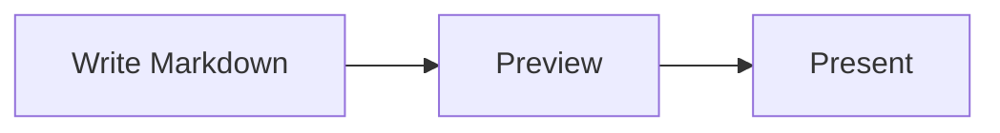

# 図とメディア

> English version: [English](../diagrams-and-media.md)

MarkdStage では、Markdown の画像、自動でレイアウトされる Mermaid、位置や経路を固定できる
Architecture DSL、そして読み込んだ Archify の図を使えます。

## Mermaid で自動レイアウトする

`mermaid` フェンスに図を書きます。

````markdown

````

Mermaid は同梱しているのでオフラインでも動きます。フローチャート、シーケンス図、クラス図など、
配置を自動で決めたい図に向いています。配色はカスタムテーマを含むスライドのテーマに合わせます。
構文に誤りがある場合は、スライドの他の内容はそのままにエラーを表示します。

その他の記述例は [Mermaid 対応例デッキ](../../examples/mermaid-support.md)を参照してください。

<details>
<summary>テーマの反映と読みやすさ</summary>

スライドの表示と書き出しでは、図の背景、図形、線、文字にテーマの配色を反映します。
Mermaid のソースで色を指定した場合は、その色が優先されることがあります。
一部のアイコンや装飾は元の色を保持します。

カスタムテーマや明示色を使う場合は、背景に対して文字や線が読みやすいか確認してください。
情報量の多い図は、ラベルを短くするか、複数のスライドに分けてください。

</details>

### PowerPoint で編集できる Mermaid

PowerPoint への書き出しでは、編集可能な図形・文字・コネクターと、見た目を保つための画像を
組み合わせます。すべての Mermaid 要素を編集できるわけではありません。

<details>
<summary>PowerPoint での編集範囲と制約</summary>

次の表は目安です。すべての構文やスタイルで編集できることを保証するものではありません。

| 図 | 編集できる代表的な要素 |
| --- | --- |
| フローチャート、クラス図、状態図、ER 図、requirement 図 | 一般的なノード、ラベル、関係線、対応する矢印などの記号 |
| シーケンス図 | 参加者、ライフライン、メッセージ、注釈、活性区間、一般的な制御枠 |
| block、packet、tree view、kanban | 基本図形、フィールド、カード、階層線、単純なラベル |
| quadrant、XY、Gantt、treemap | 対応するチャートの図形、線、軸、ラベル |
| Ishikawa、mindmap、timeline、journey | 対応する枝、ノード、カード、線、単純なラベル |
| C4、Mermaid Architecture、Event Modeling | 基本的な枠、箱、関係線、単純なラベル |
| その他の図 | 編集可能な変換に対応していない場合は画像 |

複雑な図形、アイコン、装飾付きラベル、影、グラデーション、切り抜きなどは画像になることがあります。
MarkdStage は、見た目を変えずに分離できる最小の範囲を画像として残します。
安全に分離できない場合は図全体を画像にします。画像にした箇所と理由は書き出しレポートで確認できます。

チャート形式の図も図形と文字として書き出し、**データ付きの PowerPoint グラフにはなりません**。
PowerPoint 側で配置を作り直さず、描画された図の配置を保持します。

Kanban は `kanban-beta` ではなく `kanban` と書いてください。
Mermaid の `architecture-beta` は `mermaid` フェンス内で使う構文で、
以下の JSON を記述する `architecture` フェンスとは別の形式です。

</details>

## Architecture DSL で配置を固定する

要素の位置、大きさ、コンテナー、コネクターの経路を思いどおりに固定したいときは、
`architecture` フェンスに JSON を書きます。

````markdown
```architecture
{
  "version": 1,
  "canvas": { "width": 1200, "height": 500 },
  "elements": [
    {
      "type": "node",
      "id": "client",
      "x": 80,
      "y": 160,
      "width": 260,
      "height": 140,
      "text": "Client",
      "icon": "browser"
    },
    {
      "type": "node",
      "id": "api",
      "x": 700,
      "y": 160,
      "width": 260,
      "height": 140,
      "text": "API",
      "icon": "api"
    },
    {
      "type": "connector",
      "from": "client",
      "to": "api",
      "routing": "orthogonal",
      "label": "HTTPS"
    }
  ]
}
```
````

図形にはノード、囲みにはグループ、接続にはコネクターを使います。
後述の **More controls > Shape editing** で、図を見ながら調整することもできます。

<details>
<summary>図形・レイアウト・コネクターの設定</summary>

ノードには長方形、角丸長方形、楕円、ひし形、三角形、六角形、平行四辺形を使えます。
PowerPoint ではネイティブ図形として書き出します。グループには `row`、`column`、`grid`、
`layered` のレイアウトがあり、コネクターは `straight`、`orthogonal`、`polyline` の経路を選べます。

| 設定 | 用途 |
| --- | --- |
| `x`、`y`、`width`、`height` | 位置とサイズを指定します。子要素の座標は親グループの左上を基準にします。 |
| グループの `layout` | グループ内の子要素を自動で配置します。 |
| `fromPort`、`toPort` | コネクターを図形のどこに接続するか選びます。 |
| `polyline` の `points` | コネクターの経由点を指定します。接続先の要素を移動したら見直してください。 |
| `style.dash` | 省略すると実線、`"1 5"` で点線、`"10 6"` で破線にします。 |
| `description`、`ariaLabel` | 図や要素にアクセシブルな説明を付けます。 |

見出しは短くし、ラベルに十分な余白を確保してください。密な図では文字が縮小され、
収まらない接続線のラベルが省略されることがあります。

</details>

<a id="azure-hub-spoke-example"></a>

### 実例: Azure ハブスポークネットワーク

**More controls > Open Markdown** で[サンプルデッキ](../../../site/examples/azure-hub-spoke.md)を開き、
**Shape editing** から編集を試せます。グループの入れ子、固定配置、コネクターの経路、
組み込みアイコンの使い方を確認でき、外部画像ファイルは不要です。


GitHub は `architecture` フェンスを図として描画しません。README などで共有する場合は、
描画済み画像と Markdown ソースへのリンクを掲載してください。`capture --pages` の使い方は
[CLI ガイド](cli.md)を参照してください。

## Canvas Extension で配置を調整する

Markdown の元ファイルにひも付かない Canvas で直接作ったデッキでは、
**More controls > Shape editing** を選ぶと、手早く使える配置エディターが開きます。
要素を選び、ドラッグか矢印キーで動かします。エディターには Undo、Redo、レイアウト解除があります。


Canvas で直接作ったデッキでは、変更は Canvas 側に保存されます。

発表を始める前に、編集モードを終了してください。

## Advanced Architecture Editor を使う

**More controls > Open Markdown** で読み込んだ Markdown では、
**More controls > Shape editing** から専用エディターへ直接移動します。現在のスライドに
Architecture ブロックが複数ある場合は、先にピッカーから編集対象を選びます。


エディターでは次の操作ができます。

- ノード、グループ、画像、コネクターの追加、複製、並べ替え、削除
- テキスト、形状、アイコン、位置、サイズ、スタイル、ポート、経路、親グループの変更
- グループレイアウトの適用と解除
- 画像ファイルの選択と読み込み
- キャンバスの余白ドラッグによる複数図形の矩形選択
- Space＋ドラッグ、または中ボタンドラッグによるパン（図形の上からも操作可能）
- Elements / Properties の折りたたみ。中幅では非モーダルドック、狭幅では
  キャンバスを遮断しないオーバーレイとして表示
- 補助コマンドを **More** にまとめ、キャンバスを主役として維持
- 空の図を **Add first shape** から開始
- 編集中の内容の Undo と Redo

### 複数要素を選択して編集する

| 操作 | 入力 |
| --- | --- |
| 単一選択 | 図、または Elements の項目をクリックします。 |
| 選択へ追加 | Ctrl＋クリック（macOS は Command＋クリック）。選択済みの項目は解除されません。 |
| 一覧の範囲選択 | Shift＋クリックで基点からクリックした行までを表示順に選択します。Ctrl/Command＋Shift では既存の選択に範囲を追加します。 |
| 矩形選択 | 余白をドラッグしてノード・画像・グループを完全に囲みます。Ctrl/Command を押すと追加選択になります。コネクターは直接クリックするか一覧で選びます。 |
| まとめて移動 | 選択済みの図形をドラッグします。選択図形にフォーカスがある場合は矢印キーでも移動でき、Shift＋矢印は1単位の微調整になります。 |
| 削除・複製 | Delete、Ctrl/Command＋D、またはツールバー・右クリックメニューのコマンドを使います。 |
| 操作の取り消し | ドラッグ中に Escape を押します。 |

**More > Snap to grid** は選択範囲の左上を、表示されている10 DSL 単位のグリッドに
合わせます。初期位置がグリッドからずれていても、図形同士の間隔は保ちます。
グリッドとプレビューはズーム・スクロールに追従し、スナップをオフにすると自由に移動できます。
レイアウト管理下の子要素を個別に移動するには、先に親のレイアウトを解除してください。
グループとその子を同時に選択しても、移動・削除・複製を二重に適用しません。

**Properties** には選択された全要素で編集可能な項目だけが表示されます。
同じ値はそのまま、異なる値は **Multiple values**（チェックボックスは中間状態）と表示します。
変更した項目だけが全選択要素へ適用されます。Geometry の X/Y は選択範囲の座標ではなく、
それぞれの親グループに対する相対座標です。ID、親変更、レイアウト変更、
リサイズハンドル、前後移動は単一選択時のみ利用できます。

一括編集・移動・削除・複製はそれぞれ Undo 1回で戻せます。
削除では対象を参照するコネクターも除去します。複製では選択要素と選択グループの内容をコピーし、
コピーされたコネクターの接続先も複製されていれば、その複製先へ接続します。
複製されていない接続先への参照は維持し、グループ外の未選択コネクターは複製しません。

変更は **Save** を選ぶまで下書きのままです。Markdown が外部で書き換えられていた場合、
エディターはそれを上書きしません。元のファイルを読み込み直してから、変更をやり直してください。

Advanced editing を使うには、**More controls > Open Markdown** で読み込んだ元ファイルと
ひも付くデッキと、`architecture` ブロックが必要です。次のように中身が空でも構いません。
エディターから要素を足せます。

````markdown
```architecture
```
````

## Archify の図を読み込む

[Archify](https://github.com/tt-a1i/archify) はブラウザーでアーキテクチャ図を描き、SVG として書き
出せます。書き出したファイルを `assets/` に置き、`archify` フェンスでそのパスを指定します。

````markdown
```archify
assets/checkout-architecture.svg
```
````

フェンスに書くのはパス 1 行だけです。`#` で始まる行はコメントになります。

図は画像として貼り付けられるわけではありません。MarkdStage は Archify が書き出しに記録している構造
（どの図形がコンポーネントで、どの線が接続で、どのラベルが何に属するか）を読み取り、描き直します。
そのため次の 2 点が成り立ちます。

- **デッキになじみます。** Archify 自身の色は破棄し、デッキのテーマから塗り直します。`dark`、
  `light`、`microsoft`、独自テーマのいずれでも見た目がそろい、テーマを変えれば図も変わります。役割
  を示すマークも MarkdStage 自身のアイコンで描き直されます。
- **PowerPoint には図形として出力されます。** 書き出すと、平坦な画像ではなく編集できる四角形・コネク
  ター・テキストボックスになります。レビューする人が PowerPoint 上で箱を動かしたり誤字を直したりでき
  ます。

書き出しに使った Archify のプリセット（Classic、Blueprint、Editorial など）は問いません。読み取るの
は構造だけだからです。

図を更新したときは Archify から書き出し直して再読み込みしてください。スライドを描画するたびにファイ
ルを読み直します。

## 画像を追加する

通常の Markdown 画像では `/assets/...` と書きます。

```markdown

```

Architecture のアイコンと単独画像では、先頭のスラッシュを付けません。

```json
{
  "type": "image",
  "id": "map",
  "src": "assets/map.svg",
  "fit": "contain",
  "ariaLabel": "Regional system map",
  "x": 80,
  "y": 80,
  "width": 720,
  "height": 420
}
```

Architecture の画像の収め方は `contain`、`cover`、`stretch` から選べます。
ローカルファイルは SVG、PNG、WebP、JPEG、JPG を扱えます。

[次へ: プレゼンテーションとエクスポート →](presenting-and-export.md)
